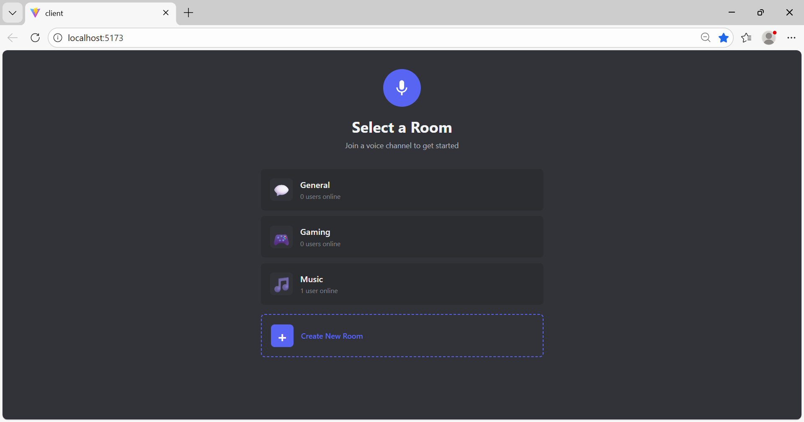
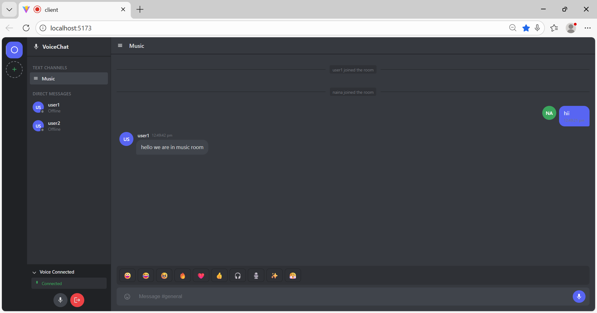

# Realtime Voice Chat System

> A full-stack real-time chat and voice communication platform that allows users to join or create rooms, chat via text and voice messages, and participate in live voice conversations with mute/unmute controls.

[](https://nodejs.org/)
[](https://socket.io/)
[](https://reactjs.org/)
[](https://redis.io/)
[](LICENSE)

## Overview

A feature-rich, production-ready real-time voice chat system built with Socket.IO, Redis, React, and Node.js. Users can create or join chat rooms, send text messages, record and share voice notes, and participate in live voice conversations with full microphone controls. Focused on real-time systems, scalability, and clean architecture.

### Why This Application?

- **Real-time everything** - Instant voice, text, and presence updates
- **Flexible communication** - Text chat, voice messages, AND live voice streaming
- **Scalable architecture** - Redis-backed state management for horizontal scaling
- **Production-ready** - Clean MVC pattern, proper error handling, graceful disconnection
- **No authentication required** - Quick access with just a username

## Features

### Room System
- **Join existing rooms** - Pre-configured rooms (General, Music, Gaming)
- **Create custom rooms** - Custom names with emoji icons
- **Live user tracking** - Real-time online count per room
- **Dynamic room list** - Updates across all clients instantly
- **Graceful leave** - Proper cleanup with real-time notifications

### Messaging
- **Real-time room chat** - Instant message delivery via WebSockets
- **Direct (1-to-1) chat** - Private messaging between users
- **Emoji reactions** - React to messages with emojis
- **Chat history** - Previous messages loaded on room join
- **System notifications** - Join/leave announcements

### Voice Communication
- **Voice messages (voice notes)**
  - Record audio using browser MediaRecorder API
  - Send as Base64-encoded audio messages
  - Playback with volume amplification (2x-4x boost)
  - Visual recording indicator
  
- **Live voice chat**
  - Real-time microphone streaming
  - Mute/unmute controls
  - Audio amplification using Web Audio API
  - Automatic stream cleanup on disconnect

### Real-Time Updates
- User join/leave notifications
- Room list synchronization across clients
- Instant message delivery
- Live presence tracking
- Connection state management

## Tech Stack

**Frontend:**
- React 18 + Vite
- Socket.IO Client
- Browser Native APIs:
  - MediaRecorder (voice recording)
  - getUserMedia (microphone access)
  - Web Audio API (volume amplification)
- Modern CSS with responsive design

**Backend:**
- Node.js + Express.js
- Socket.IO (WebSocket server)
- Redis (real-time state & pub-sub)
- Multer (voice message upload handling)
- CORS middleware

**DevOps & Tools:**
- Docker (Redis containerization)
- Nodemon (development)
- Git & GitHub

## System Architecture

```
┌─────────────────┐
│  Client (React) │
│   - UI Layer    │
│   - Socket.IO   │
│   - Audio APIs  │
└────────┬────────┘
         │
         │ WebSocket (Socket.IO)
         │
         ▼
┌─────────────────────────┐
│  Server (Node.js)       │
│   - Express Routes      │
│   - Socket Controllers  │
│   - Services Layer      │
└────────┬────────────────┘
         │
         │ Real-time state
         │ Pub/Sub messaging
         │
         ▼
┌─────────────────┐
│     Redis       │
│  - Room state   │
│  - User presence│
│  - Chat history │
└─────────────────┘
```

### Data Flow Architecture

```
User Action → Socket Event → Controller → Service → Store/Redis → Broadcast
```

**Example: User Joins Room**
1. User clicks "Join Room" → Client emits `room:join`
2. `roomSocketController` receives event
3. `joinRoom` service updates user list in memory
4. `setOnline` updates presence in Redis
5. `updateRoomUserCount` updates room stats
6. Server broadcasts `room:users` and `rooms:list` to all clients
7. New user receives `chat:history`
8. System message broadcasted: "User joined the room"

## Voice Message Implementation

### Recording Flow

**1. Microphone Access**
```javascript
const stream = await navigator.mediaDevices.getUserMedia({ audio: true });
```

**2. Audio Recording**
```javascript
const mediaRecorder = new MediaRecorder(stream);
const audioChunks = [];

mediaRecorder.ondataavailable = (event) => {
  audioChunks.push(event.data);
};

mediaRecorder.onstop = () => {
  const audioBlob = new Blob(audioChunks, { type: 'audio/webm' });
  // Send to server
};
```

**3. Encoding to Base64**
```javascript
const reader = new FileReader();
reader.readAsDataURL(audioBlob);
reader.onloadend = () => {
  const base64Audio = reader.result;
  socket.emit('chat:send:voice', { roomId, audio: base64Audio });
};
```

### Sending & Broadcasting

**Server Side:**
```javascript
socket.on('chat:send:voice', async ({ roomId, audio }) => {
  const message = {
    id: generateId(),
    roomId,
    type: 'voice',
    audio: audio, // Base64 string
    user: socket.data.user.name,
    createdAt: Date.now()
  };
  
  await addChat(roomId, message);
  io.to(roomId).emit('chat:message', message);
});
```

### Playback with Amplification

**Client Side:**
```javascript
// Decode Base64
const audioContext = new AudioContext();
const audioBuffer = await fetch(base64Audio)
  .then(res => res.arrayBuffer())
  .then(buffer => audioContext.decodeAudioData(buffer));

// Create gain node for volume boost
const source = audioContext.createBufferSource();
const gainNode = audioContext.createGain();

source.buffer = audioBuffer;
gainNode.gain.value = 3.0; // 3x amplification

// Connect: source → gain → speakers
source.connect(gainNode);
gainNode.connect(audioContext.destination);

source.start();
```

> ⚠️ **Production Note:** Base64 encoding is used for simplicity in this version. For production deployment, audio files should be:
> - Stored in cloud storage (AWS S3, Cloudinary, Azure Blob)
> - Shared via secure URLs
> - Compressed for bandwidth optimization
> - Cached for faster playback

## Live Voice Chat Flow

**Connection Setup:**

1. **User joins room**
   ```javascript
   socket.emit('room:join', { roomId, user: { name } });
   ```

2. **Microphone stream captured**
   ```javascript
   const localStream = await navigator.mediaDevices.getUserMedia({ 
     audio: {
       echoCancellation: true,
       noiseSuppression: true,
       autoGainControl: true
     } 
   });
   ```

3. **Audio streaming**
   - Stream chunks sent via Socket.IO
   - Server broadcasts to all room members
   - Received on other clients and played

4. **Mute/Unmute controls**
   ```javascript
   // Mute
   localStream.getAudioTracks().forEach(track => {
     track.enabled = false;
   });
   
   // Unmute
   localStream.getAudioTracks().forEach(track => {
     track.enabled = true;
   });
   ```

5. **Leave room cleanup**
   ```javascript
   // Stop all tracks
   localStream.getTracks().forEach(track => track.stop());
   
   // Emit leave event
   socket.emit('room:leave');
   ```

## Quick Start

### Prerequisites

- Node.js 20.x or higher
- npm 9+
- Docker (for Redis)
- Modern web browser with microphone support (Chrome, Firefox, Safari, Edge)

### Installation

**1. Clone the repository**

```bash
git clone https://github.com/NainaKothari-14/Realtime-Voice-Chat-System.git
cd Realtime-Voice-Chat-System
```

**2. Start Redis (Docker)**

```bash
docker run -d --name redis-voice -p 6379:6379 redis:7
```

Verify Redis is running:
```bash
docker ps | grep redis-voice
```

**3. Server Setup**

```bash
cd server
npm install
npm run dev
```

Server runs at `http://localhost:5000`

**4. Client Setup**

Open a new terminal:

```bash
cd client
npm install
npm run dev
```

Client runs at `http://localhost:5173`

**5. Test the Application**

1. Open `http://localhost:5173` in your browser
2. Enter your username (e.g., "Alice")
3. Select an existing room (General, Music, Gaming) or create a new one
4. Allow microphone access when prompted
5. Test features:
   - Send a text message
   - Record and send a voice message
   - Try mute/unmute for live voice
   - React to messages with emojis
   - Open another browser tab with a different user to test real-time updates

**Quick Multi-User Test:**
1. Open the app in two browser windows (or use incognito)
2. User 1: "Alice" joins "General" room
3. User 2: "Bob" joins "General" room
4. Both users should see each other in the user list
5. Send messages back and forth
6. Try voice messages and live voice chat
7. Test leave/rejoin functionality


## Screenshots

### User Entry Page


*Clean login interface where users enter their username to begin chatting*

---

### Select / Create Room


*Choose from existing rooms or create your own with custom name and emoji*

---

### Different Rooms Available


*Multiple active rooms with live user counts - General, Music, Gaming, and more*

---

### Chat Room Interface


*Full-featured chat room with text messages, user list, and real-time updates*

---

### Direct Chat (1-on-1)


*Private messaging between users with full chat history*

---

### Voice Message Feature


*Record and send voice notes with playback controls and volume amplification*

---

### Microphone Controls & Exit Button


*Live voice chat with mute/unmute toggle and graceful room exit*

---

### Emoji Reactions


*React to messages with emojis for expressive communication*

---


## API Documentation

### REST API Endpoints

#### Get Active Rooms

**Endpoint**

```http
GET http://localhost:5000/api/rooms
```

**Response**

```json
{
  "rooms": [
    {
      "id": "general",
      "name": "General",
      "icon": "💬",
      "users": 5
    },
    {
      "id": "music",
      "name": "Music",
      "icon": "🎵",
      "users": 3
    },
    {
      "id": "gaming",
      "name": "Gaming",
      "icon": "🎮",
      "users": 8
    }
  ]
}
```

### Socket.IO Events Reference

#### Client → Server Events

**Join Room**
```javascript
socket.emit('room:join', {
  roomId: 'general',
  user: { name: 'John Doe' }
});
```

**Leave Room**
```javascript
socket.emit('room:leave');
```

**Send Text Message**
```javascript
socket.emit('chat:message', {
  roomId: 'general',
  text: 'Hello everyone!',
  user: { name: 'John Doe' }
});
```

**Send Voice Message**
```javascript
socket.emit('chat:send:voice', {
  roomId: 'general',
  audio: base64AudioString, // Base64-encoded audio blob
  user: { name: 'John Doe' }
});
```

**Send Direct Message**
```javascript
socket.emit('chat:direct', {
  to: 'Jane Doe', // recipient username
  text: 'Hey! How are you?',
  user: { name: 'John Doe' }
});
```

**Add Reaction to Message**
```javascript
socket.emit('chat:reaction', {
  messageId: 'msg-123',
  emoji: '👍',
  user: { name: 'John Doe' }
});
```

**Live Voice Streaming (Mute/Unmute handled client-side)**
```javascript
// Start streaming
const stream = await navigator.mediaDevices.getUserMedia({ audio: true });
// Stream is managed locally; Socket.IO handles presence

// Mute
stream.getAudioTracks()[0].enabled = false;

// Unmute  
stream.getAudioTracks()[0].enabled = true;
```

#### Server → Client Events

**Room User List**
```javascript
socket.on('room:users', (users) => {
  // Array of users currently in the room
  console.log(users); 
  // [{ name: 'John' }, { name: 'Jane' }, { name: 'Bob' }]
});
```

**Updated Rooms List (Broadcast to all)**
```javascript
socket.on('rooms:list', (rooms) => {
  // Complete room list with live user counts
  console.log(rooms);
  // [{ id: 'general', name: 'General', icon: '💬', users: 5 }, ...]
});
```

**Chat History (on join)**
```javascript
socket.on('chat:history', (messages) => {
  // Array of previous messages in the room
  console.log(messages);
  /*
  [
    {
      id: 'msg-1',
      roomId: 'general',
      type: 'user',
      text: 'Welcome!',
      user: 'Alice',
      createdAt: 1704067200000
    },
    {
      id: 'msg-2',
      roomId: 'general',
      type: 'voice',
      audio: 'data:audio/webm;base64,...',
      user: 'Bob',
      createdAt: 1704067300000
    }
  ]
  */
});
```

**New Message**
```javascript
socket.on('chat:message', (message) => {
  console.log(message);
  /*
  {
    id: 'msg-123',
    roomId: 'general',
    type: 'user', // or 'system' or 'voice'
    text: 'Hello!', // (only for text messages)
    audio: 'base64...', // (only for voice messages)
    user: 'John Doe',
    createdAt: 1704067400000
  }
  */
});
```

**Direct Message Received**
```javascript
socket.on('chat:direct:received', (message) => {
  console.log(message);
  /*
  {
    from: 'Alice',
    text: 'Hey!',
    createdAt: 1704067500000
  }
  */
});
```

**Message Reaction Update**
```javascript
socket.on('chat:reaction:update', ({ messageId, reactions }) => {
  console.log(reactions);
  // { '👍': 3, '❤️': 2, '😂': 1 }
});
```

### Example: Complete Chat Flow

```javascript
// 1. Connect to server
const socket = io('http://localhost:5000');

// 2. Join a room
socket.emit('room:join', {
  roomId: 'general',
  user: { name: 'Alice' }
});

// 3. Listen for room updates
socket.on('room:users', (users) => {
  updateUserList(users);
});

socket.on('rooms:list', (rooms) => {
  updateRoomList(rooms);
});

// 4. Load chat history
socket.on('chat:history', (messages) => {
  displayMessages(messages);
});

// 5. Listen for new messages
socket.on('chat:message', (message) => {
  appendMessage(message);
});

// 6. Send a message
function sendMessage(text) {
  socket.emit('chat:message', {
    roomId: 'general',
    text: text,
    user: { name: 'Alice' }
  });
}

// 7. Leave room
socket.emit('room:leave');
```


## Key Learnings & Insights

### Real-Time Systems
- WebSocket-based bidirectional communication with Socket.IO
- Redis for shared state management across server instances
- Event-driven architecture for real-time updates
- Handling connection/disconnection edge cases

### Audio Processing in Browsers
- Recording audio using MediaRecorder API
- Base64 encoding for transport (prototype approach)
- Web Audio API for volume amplification
- Managing microphone permissions and streams

### Clean Architecture
- MVC pattern for organized codebase
- Service layer for business logic
- In-memory + Redis hybrid storage
- Socket controller separation by domain (room, chat, voice)

### User Experience
- Graceful disconnection handling
- Duplicate event prevention (leftManually flag)
- Real-time presence tracking
- Chat history on room join

## Future Improvements

### Storage & Media
- [ ] Store voice messages in S3/Cloudinary instead of Base64
- [ ] Add message retention policies
- [ ] Implement message edit/delete functionality
- [ ] File sharing capabilities

### Authentication & Security
- [ ] User authentication (JWT / OAuth)
- [ ] Private rooms with passwords
- [ ] User roles and permissions
- [ ] Rate limiting for messages and voice uploads

### Features
- [ ] Typing indicators
- [ ] Message seen/delivered status
- [ ] @mentions and notifications
- [ ] User profiles with avatars
- [ ] Voice chat recording/playback
- [ ] Screen sharing

### Performance & Scalability
- [ ] Redis Pub/Sub for multi-instance deployment
- [ ] Message pagination and lazy loading
- [ ] Audio compression before upload
- [ ] CDN integration for static assets

### Mobile & PWA
- [ ] Responsive mobile design
- [ ] Progressive Web App (PWA) support
- [ ] Push notifications
- [ ] Offline message queueing

### Deployment
- [ ] Production deployment guide
- [ ] Docker Compose for full stack
- [ ] CI/CD pipeline
- [ ] Monitoring and logging (Sentry, DataDog)


## Configuration

### Environment Variables

**Server `.env`:**

```env
PORT=5000
NODE_ENV=development
CLIENT_URL=http://localhost:5173
REDIS_URL=redis://localhost:6379
```

**Client `.env`:**

```env
VITE_SERVER_URL=http://localhost:5000
```

### Redis Configuration

The application uses Redis for:
- User presence tracking (`presence.store.js`)
- Chat history persistence (`chat.store.js`)
- Pub/Sub for potential multi-instance scaling

**Connection setup:**
```javascript
// config/redis.config.js
import Redis from 'ioredis';

const redis = new Redis({
  host: process.env.REDIS_HOST || 'localhost',
  port: process.env.REDIS_PORT || 6379,
  retryStrategy: (times) => Math.min(times * 50, 2000)
});

export default redis;
```

### CORS Configuration

```javascript
const corsOptions = {
  origin: process.env.CLIENT_URL || 'http://localhost:5173',
  credentials: true,
  methods: ['GET', 'POST']
};

app.use(cors(corsOptions));
```

## Troubleshooting

### Microphone Not Working

**Browser Permissions:**
1. Check browser address bar for microphone icon
2. Click and select "Allow"
3. Refresh the page if needed

**Common Issues:**
- ❌ Browser doesn't support MediaRecorder (use Chrome/Firefox/Edge)
- ❌ HTTPS required for microphone (except localhost)
- ❌ Microphone in use by another app
- ❌ Hardware/driver issues

**Debug:**
```javascript
navigator.mediaDevices.getUserMedia({ audio: true })
  .then(stream => console.log('✅ Microphone access granted'))
  .catch(err => console.error('❌ Microphone error:', err));
```

### Voice Messages Not Playing

**Check console for errors:**
```javascript
// Client-side debugging
console.log('Audio data length:', audioBase64.length);
console.log('Audio format:', audioBase64.substring(0, 30));
```

**Common fixes:**
- Ensure Base64 string includes `data:audio/webm;base64,` prefix
- Check browser audio codec support
- Verify volume amplification isn't causing distortion

### Redis Connection Errors

**Error: `ECONNREFUSED`**
```bash
# Verify Redis is running
docker ps | grep redis

# If not running, start it
docker run -d --name redis-voice -p 6379:6379 redis:7

# Test connection
redis-cli ping  # Should return "PONG"
```

**Error: `Connection timeout`**
- Check firewall settings
- Verify REDIS_URL in `.env`
- Ensure Redis port 6379 is exposed

### Socket Disconnections

**Enable debugging:**
```javascript
// Client-side
const socket = io('http://localhost:5000', {
  reconnection: true,
  reconnectionDelay: 1000,
  reconnectionAttempts: 5
});

socket.on('disconnect', (reason) => {
  console.log('Disconnected:', reason);
  if (reason === 'io server disconnect') {
    // Server initiated disconnect, reconnect manually
    socket.connect();
  }
});

socket.on('reconnect', (attemptNumber) => {
  console.log(`Reconnected after ${attemptNumber} attempts`);
});
```

**Common causes:**
- Network interruptions
- Server restart
- Browser tab suspended (mobile)
- CORS issues

### Users Not Appearing in Room

**Debug checklist:**
```javascript
// 1. Check socket connection
console.log('Connected:', socket.connected);
console.log('Socket ID:', socket.id);

// 2. Verify room join
socket.emit('room:join', { roomId, user }, (ack) => {
  console.log('Join ACK:', ack);
});

// 3. Check event listeners
socket.on('room:users', (users) => {
  console.log('Room users updated:', users);
});
```

### Duplicate Notifications

The `leftManually` flag prevents this:

```javascript
socket.on('room:leave', async () => {
  socket.data.leftManually = true; // ✅ Set flag
  // ... cleanup logic
});

socket.on('disconnecting', async () => {
  if (socket.data.leftManually) return; // ✅ Skip if manual leave
  // ... handle disconnection
});
```

### Chat History Not Loading

**Check Redis data:**
```bash
redis-cli
> KEYS chat:*
> GET chat:general
```

**Verify service call:**
```javascript
// Server-side
socket.on('room:join', async ({ roomId, user }) => {
  const history = await getChatHistory(roomId);
  console.log(`Sending ${history.length} messages to ${user.name}`);
  socket.emit('chat:history', history);
});
```


## Production Deployment

### Environment Setup

**Server `.env`:**
```env
NODE_ENV=production
PORT=5000
CLIENT_URL=https://your-domain.com
REDIS_URL=redis://your-redis-host:6379
```

**Client `.env`:**
```env
VITE_SERVER_URL=https://api.your-domain.com
```

### Security Best Practices

**1. Rate Limiting**

```bash
npm install express-rate-limit
```

```javascript
import rateLimit from 'express-rate-limit';

const limiter = rateLimit({
  windowMs: 15 * 60 * 1000, // 15 minutes
  max: 100, // limit each IP to 100 requests per window
  message: 'Too many requests from this IP'
});

app.use('/api/', limiter);
```

**2. Security Headers (Helmet)**

```bash
npm install helmet
```

```javascript
import helmet from 'helmet';

app.use(helmet({
  contentSecurityPolicy: {
    directives: {
      defaultSrc: ["'self'"],
      connectSrc: ["'self'", "wss:", "https:"]
    }
  }
}));
```

**3. Input Validation**

```javascript
socket.on('room:join', async ({ roomId, user }) => {
  // Sanitize username
  const name = user?.name?.trim();
  
  // Validation
  if (!name || name.length < 2 || name.length > 20) {
    socket.emit('error', { message: 'Username must be 2-20 characters' });
    return;
  }
  
  if (!/^[a-zA-Z0-9_\s]+$/.test(name)) {
    socket.emit('error', { message: 'Username contains invalid characters' });
    return;
  }
  
  // Continue with room join...
});
```

**4. Environment-based CORS**

```javascript
const allowedOrigins = process.env.NODE_ENV === 'production'
  ? [process.env.CLIENT_URL]
  : ['http://localhost:5173', 'http://localhost:3000'];

app.use(cors({
  origin: (origin, callback) => {
    if (!origin || allowedOrigins.includes(origin)) {
      callback(null, true);
    } else {
      callback(new Error('Not allowed by CORS'));
    }
  },
  credentials: true
}));
```

### Docker Deployment

**docker-compose.yml:**

```yaml
version: '3.8'

services:
  redis:
    image: redis:7-alpine
    ports:
      - "6379:6379"
    volumes:
      - redis-data:/data
    restart: unless-stopped
    command: redis-server --appendonly yes

  server:
    build: ./server
    ports:
      - "5000:5000"
    environment:
      - NODE_ENV=production
      - PORT=5000
      - REDIS_URL=redis://redis:6379
      - CLIENT_URL=https://your-domain.com
    depends_on:
      - redis
    restart: unless-stopped

  client:
    build: ./client
    ports:
      - "80:80"
    environment:
      - VITE_SERVER_URL=https://api.your-domain.com
    restart: unless-stopped

volumes:
  redis-data:
```

**Deploy:**

```bash
# Build and start all services
docker-compose up -d

# View logs
docker-compose logs -f

# Stop all services
docker-compose down
```

### Monitoring & Logging

**Add Logging Middleware:**

```bash
npm install morgan winston
```

```javascript
import morgan from 'morgan';
import winston from 'winston';

const logger = winston.createLogger({
  level: 'info',
  format: winston.format.json(),
  transports: [
    new winston.transports.File({ filename: 'error.log', level: 'error' }),
    new winston.transports.File({ filename: 'combined.log' })
  ]
});

app.use(morgan('combined', {
  stream: { write: (message) => logger.info(message.trim()) }
}));
```

### Performance Optimization

**1. Redis Connection Pooling**

```javascript
import Redis from 'ioredis';

const redis = new Redis({
  host: process.env.REDIS_HOST,
  port: process.env.REDIS_PORT,
  lazyConnect: true,
  retryStrategy: (times) => Math.min(times * 50, 2000),
  maxRetriesPerRequest: 3
});
```

**2. Socket.IO Adapter for Scaling**

```bash
npm install @socket.io/redis-adapter
```

```javascript
import { createAdapter } from '@socket.io/redis-adapter';
import { createClient } from 'redis';

const pubClient = createClient({ url: process.env.REDIS_URL });
const subClient = pubClient.duplicate();

await Promise.all([pubClient.connect(), subClient.connect()]);

io.adapter(createAdapter(pubClient, subClient));
```

**3. Message Size Limits**

```javascript
io.on('connection', (socket) => {
  socket.use(([event, ...args], next) => {
    const data = JSON.stringify(args);
    if (data.length > 50000) { // 50KB limit
      return next(new Error('Message too large'));
    }
    next();
  });
});
```

## Contributing

Contributions are welcome! To contribute:

1. **Fork the repository**
2. **Create a feature branch**
   ```bash
   git checkout -b feature/amazing-feature
   ```
3. **Make your changes and commit**
   ```bash
   git commit -m 'Add amazing feature'
   ```
4. **Push to your branch**
   ```bash
   git push origin feature/amazing-feature
   ```
5. **Open a Pull Request**

### Development Guidelines

- Follow the existing code style
- Write meaningful commit messages
- Add comments for complex logic
- Test your changes locally
- Update documentation as needed

## License

This project is licensed under the MIT License - see the [LICENSE](LICENSE) file for details.

## Author

**Naina Kothari**  
GitHub: [@NainaKothari-14](https://github.com/NainaKothari-14)

## Acknowledgments

- [Socket.IO](https://socket.io/) for real-time communication
- [Redis](https://redis.io/) for blazing-fast data storage
- [React](https://react.dev/) for building the UI
- [Vite](https://vitejs.dev/) for lightning-fast development
- [pdf-lib](https://pdf-lib.js.org/) for inspiration on clean documentation

## Support

If you have questions or need help:

- Open an [issue](https://github.com/NainaKothari-14/Realtime-Voice-Chat-System/issues)
- Start a [discussion](https://github.com/NainaKothari-14/Realtime-Voice-Chat-System/discussions)
- Star this repo if you find it helpful!

---

**❤️Built with Socket.IO, Redis, React, and Node.js**

*If this project helps you, consider giving it a star⭐*
